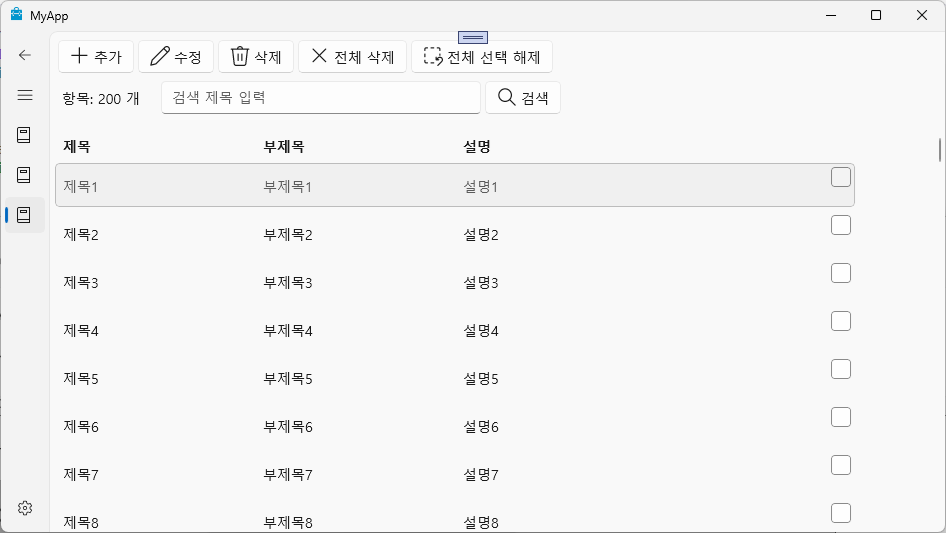
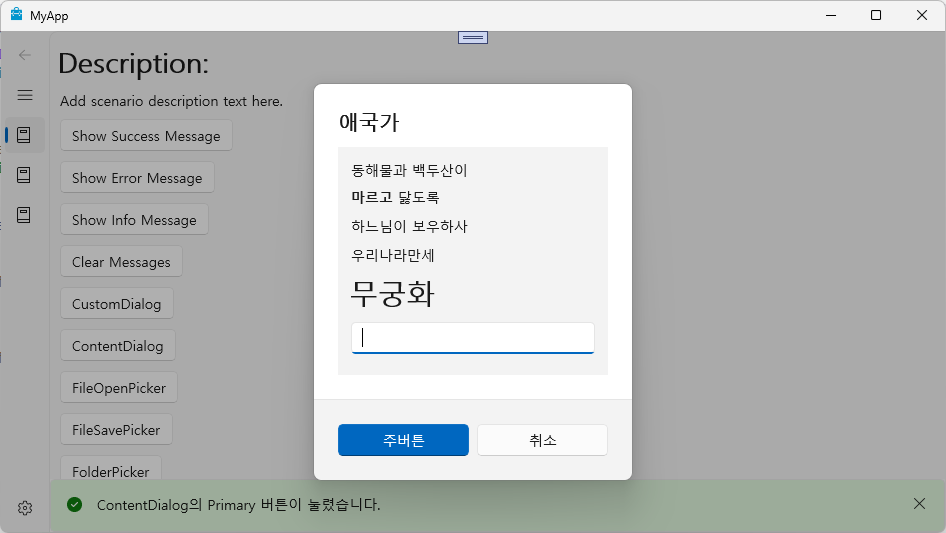

# MyApp - WinUI 3 예제 프로젝트

이 프로젝트는 **WinUI 3**와 C++/WinRT를 활용하여 데스크톱 애플리케이션을 개발하는 방법을 예제 코드로 보여줍니다.  
주요 기능, 구조, 빌드 및 실행 방법, 그리고 WinUI 3의 활용 예시를 포함합니다.

---

## 주요 특징

- **WinUI 3 기반 C++/WinRT 프로젝트**
- MVVM 패턴 적용: `MyViewModel`, `MyItem` 등
- 다양한 XAML 페이지(`MainPage`, `Page1`, `MyItemViewPage`, `SettingsPage` 등)와 다이얼로그(`MyDialog`) 제공
- 파일/폴더 선택, ContentDialog, 커스텀 다이얼로그 등 WinUI 3의 주요 UI 컴포넌트 활용
- ObservableVector를 통한 데이터 바인딩 예시

---

## 프로젝트 구조

- `MyApp\UI\MainWindow.xaml` : 앱의 메인 윈도우
- `MyApp\UI\MainPage.xaml` : 주요 네비게이션 및 컨텐츠 페이지
- `MyApp\UI\Page1.xaml.cpp` : 파일/폴더 선택, ContentDialog, 커스텀 다이얼로그 등 WinUI 3 기능 예제
- `MyApp\UI\MyViewModel.h/cpp` : MVVM 패턴의 ViewModel, 데이터 바인딩 및 싱글턴 패턴 예시
- `MyApp\UI\MyItem.h/cpp` : 데이터 모델, INotifyPropertyChanged 구현
- `MyApp\UI\MyDialog.xaml` : 사용자 정의 다이얼로그
- `MyApp\Styles.xaml` : 공통 스타일 정의

---

## 빌드 및 실행 방법

1. **Visual Studio 2022**에서 솔루션을 엽니다.
2. 필요한 Windows SDK 및 WinUI 3 확장(프로젝트 템플릿 포함)이 설치되어 있는지 확인합니다.
3. `x64` 또는 `x86` 구성으로 빌드합니다.
4. 실행(F5)하여 WinUI 3 데스크톱 앱을 확인합니다.

---

## 주요 WinUI 3 사용 예시

### 1. MVVM 패턴 및 데이터 바인딩

- `MyViewModel`에서 ObservableVector로 200개의 `MyItem`을 생성하여 바인딩합니다.
- 각 `MyItem`은 `Title`, `Subtitle`, `Description` 속성을 가지며, 변경 알림을 지원합니다.


### 2. 파일/폴더 선택기(File/Folder Picker)

- WinUI 3에서 데스크톱용 파일/폴더 선택기를 사용하는 방법을 보여줍니다.
```

// Page1.xaml.cpp 일부 
FileOpenPicker picker; 

picker.as<IInitializeWithWindow>()->Initialize(hwnd); 
picker.FileTypeFilter().Append(L".txt"); 
picker.FileTypeFilter().Append(L".png"); 
picker.FileTypeFilter().Append(L".jpg"); 

StorageFile file = co_await picker.PickSingleFileAsync();

```

### 3. ContentDialog 및 커스텀 다이얼로그

- 기본 ContentDialog와 XAML로 정의한 커스텀 다이얼로그를 모두 예시로 제공합니다.

```
// ContentDialog 예시 
ContentDialog dialog; 

dialog.Title(box_value(L"컨텐트다이얼로그"));
dialog.Content(box_value(L"확인 또는 취소 버튼 누르세요.")); 
dialog.PrimaryButtonText(L"확인"); 
dialog.CloseButtonText(L"취소"); 

const auto result = co_await dialog.ShowAsync();

```

## 스크린샷

아래는 실제 실행 화면 예시입니다.




---

## 참고

- WinUI 3 공식 문서: https://learn.microsoft.com/ko-kr/windows/apps/winui/winui3/
- C++/WinRT 공식 문서: https://learn.microsoft.com/ko-kr/windows/uwp/cpp-and-winrt-apis/

---

## 라이선스

이 프로젝트는 예제 및 학습 목적입니다.


